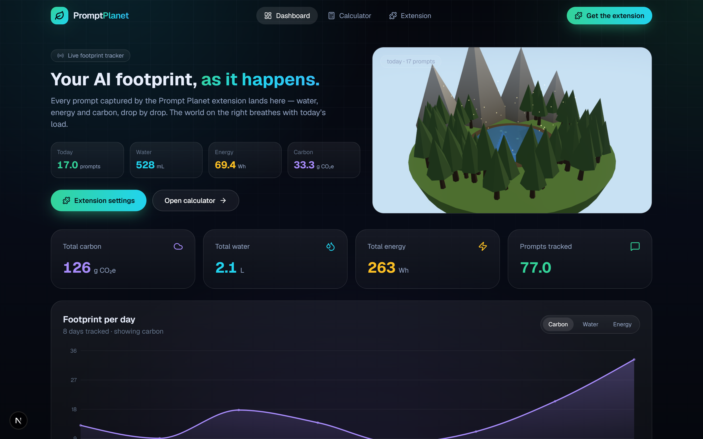
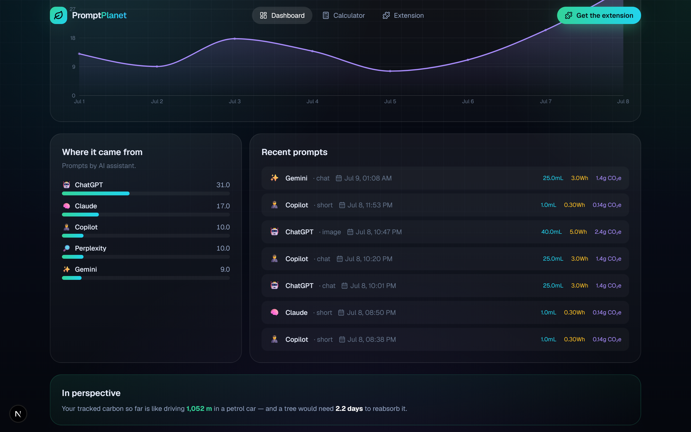
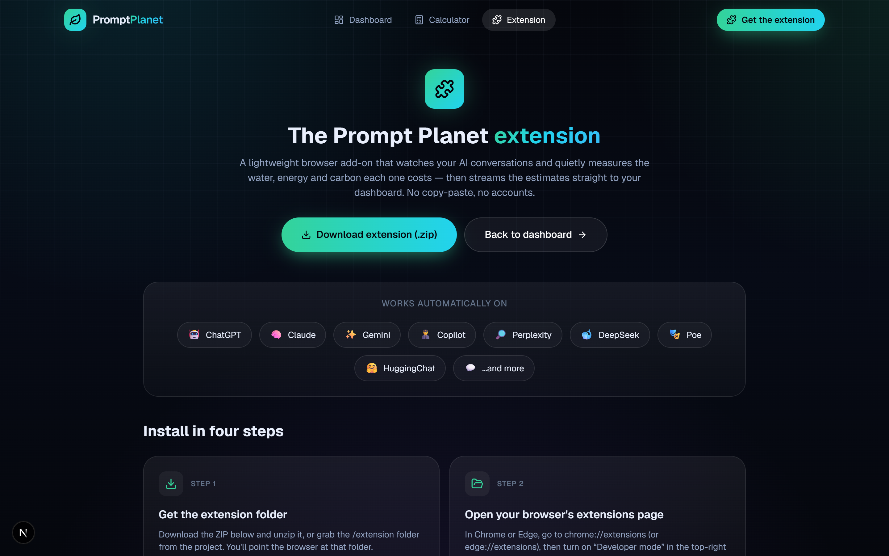
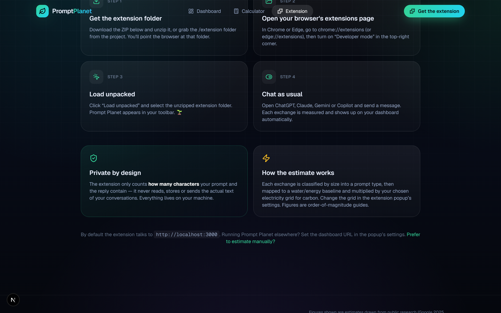
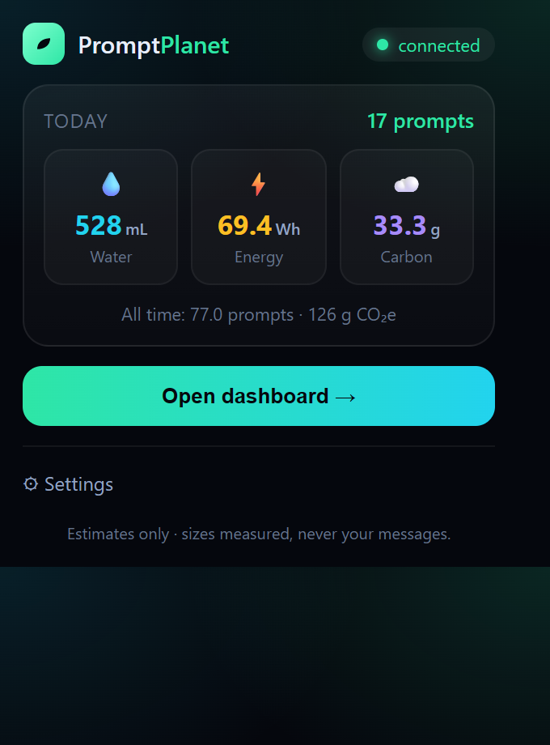
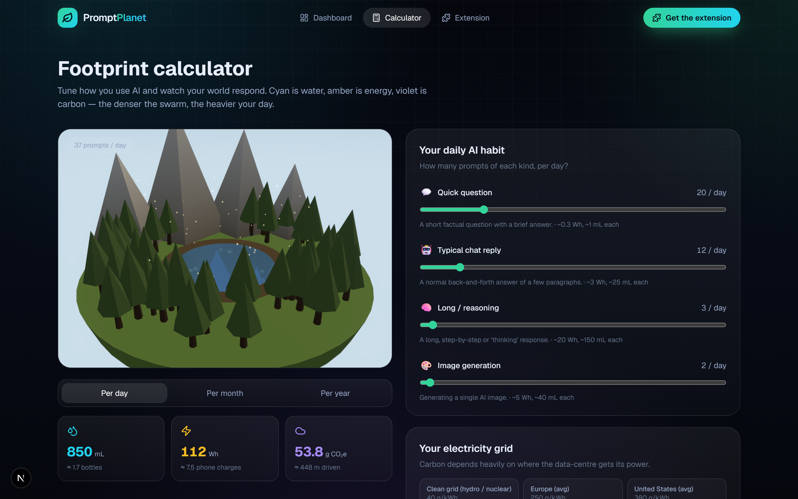

<!-- ░░░░░░░░░░░░░░░░░░░░░░░░░░░░░░░░░░░░░░░░░░░░░░░░░░░░░░░░░░░░░░░░░░░░░░░ -->
<div align="center">


<br/>

<em>Every prompt sips water, burns electricity, and breathes out CO₂.<br/>
<b>Prompt&nbsp;Planet</b> is a browser extension + dashboard that measures the real footprint of your
AI chats — <b>automatically</b>, privately, in living 3&nbsp;D.</em>

<br/><br/>

<!-- Genji dragon-green badge row -->


<br/>


</div>


<!-- ░░░░░░░░░░░░░░░░░░░░░░░░░░░░░░░░░░░░░░░░░░░░░░░░░░░░░░░░░░░░░░░░░░░░░░░ -->

## 🌍 What is Prompt Planet?

You type **“hello”** to an AI. It replies **“Hello Tarun — what are you working on?”** Tiny, right?
Multiply that by every prompt you send, every day. Prompt Planet makes the hidden cost visible:

1. 🧩 A **browser extension** rides along on ChatGPT, Claude, Gemini, Copilot & more. Every time you
   send a message, it measures how big the exchange was and estimates the **water 💧, energy ⚡ and
   carbon ☁️** it cost.
2. 📊 Those estimates stream to your **live dashboard** — a 3&nbsp;D world that breathes with today’s
   load, a per-day chart, and a breakdown of which assistant you used most.
3. 🔒 **No accounts, no cloud, no message text.** The extension counts *sizes only* — never what you
   actually wrote — and everything is stored locally on your machine.

<div align="center">
<br/>

<br/>
<sub><b>Meet Sprout</b> — your planet gets lusher the lighter your footprint. 🌱</sub>
</div>


## ⚙️ How it works

```
   You chat with an AI                the extension                  your dashboard
 ┌──────────────────────┐        ┌───────────────────────┐      ┌──────────────────────┐
 │  "hello"             │        │  content script:      │      │  Next.js app         │
 │  → "Hello Tarun…"    │  ───▶  │  measure prompt/reply │ ───▶ │  POST /api/track     │
 │  (ChatGPT/Claude/…)  │        │  sizes (chars only)   │      │  → local JSON store  │
 └──────────────────────┘        │  service worker:      │      │  → live 3D dashboard │
                                 │  classify + estimate  │      └──────────────────────┘
                                 └───────────────────────┘
```

- **Content script** (`extension/content.js`) detects when you send a message and measures how many
  characters the prompt and the reply held — using per-site selectors with a site-agnostic fallback.
- **Service worker** (`extension/background.js`) classifies the exchange (short / chat / long / image),
  estimates the footprint, updates the toolbar badge, and `POST`s it to the dashboard.
- **The API** (`/api/track`, no auth, CORS-open) recomputes the footprint server-side and stores it.
- **The dashboard** (`/`) polls every few seconds, so prompts appear **as they happen**.


## ✨ A quick tour

### 📊 The live dashboard — your footprint as it happens

Opening the app *is* your dashboard. Today’s prompts, water, energy and carbon up top; a 3&nbsp;D world
that gets denser the heavier your day; all-time totals; and a per-day chart you can flip between
metrics.

<div align="center">

</div>

<br/>

Scroll down for **where it came from** (prompts by assistant), a live **recent prompts** feed, and an
*in-perspective* readout.

<div align="center">

</div>

### 🧩 The extension — install once, forget about it

<div align="center">

<br/><br/>

</div>

### 🪟 The toolbar popup

A glanceable summary in your browser toolbar — today’s totals, all-time carbon, a connection
indicator, and quick settings (dashboard URL, electricity grid, on/off).

<div align="center">

</div>

### 🧮 The manual calculator (optional)

No extension? Estimate by hand — drag the sliders for each prompt type, pick your grid, and watch the
same 3&nbsp;D world respond.

<div align="center">

</div>


## 🐉 The living 3D world

The centrepiece is a **floating snow-globe valley** whose *health* is driven by your footprint —
live on the dashboard (today’s load) and on the calculator (your sliders). Rendered in Three.js with
a soft **bloom** glow.

```
health = 1 − average( waterLoad, energyLoad, carbonLoad )     // 0 = dying · 1 = lush
```

| Metric | Drives… | Healthy | Heavy |
| :-- | :-- | :-- | :-- |
| 💧 **Water** | the lake & rivers | brimming, clear blue | shrinking, muddy |
| ⚡ **Energy** | the sky & smog | bright, clean air | hazy, overcast |
| ☁️ **Carbon** | the forest | dense green pines | thinning, browning |

It’s **procedurally generated** — a seeded `mulberry32` noise field lays out the terrain, and two
hand-tuned palettes (`HEALTHY` ⇄ `DEGRADED`) are blended by the live health value. Maths in pure,
SSR-safe modules ([`biome.ts`](src/lib/biome.ts), [`noise.ts`](src/lib/noise.ts)); [`Biome.tsx`](src/components/three/Biome.tsx) turns them into materials.


## 🔬 How the estimate is calculated

Public research on AI’s footprint disagrees by **more than 100×**, so Prompt Planet uses a small,
transparent model instead of pretending there’s one exact number. The extension measures **sizes**;
the model turns them into a footprint. Shared between the extension ([`extension/footprint.js`](extension/footprint.js))
and the website ([`src/lib/impact.ts`](src/lib/impact.ts)) so they always agree.

**1 · Classify the exchange by size**

| Type | When | Energy | Water |
| :-- | :-- | --: | --: |
| 💬 short | reply ≤ 240 chars | 0.3 Wh | 1 mL |
| 🤖 chat | reply ≤ 1600 chars | 3 Wh | 25 mL |
| 🧠 long | bigger / reasoning | 20 Wh | 150 mL |
| 🎨 image | image generation | 5 Wh | 40 mL |

> So your **“hello”** → a 38-character reply lands as a **short** prompt: ≈ 0.3 Wh, 1 mL, 0.14 g CO₂e.

**2 · Turn energy into carbon** using your electricity grid:

```
CO₂ (g) = energy (kWh) × gridIntensity (g CO₂e / kWh)
```

| Grid | Intensity | | Grid | Intensity |
| :-- | --: | :-- | :-- | --: |
| 🌿 Clean (hydro/nuclear) | 40 | | 🌍 Global average | 480 |
| 🇪🇺 Europe avg | 250 | | 🇮🇳 India avg | 630 |
| 🇺🇸 US avg | 380 | | 🏭 Coal-heavy | 820 |

> [!NOTE]
> **Order-of-magnitude guide, not gospel.** Baselines are anchored to public sources — Google’s 2025
> Environmental Report (≈0.24 Wh / 0.26 mL per median Gemini text prompt), UC Riverside’s *“Making AI
> Less Thirsty”*, and widely-cited ChatGPT energy estimates — then set to a middle-of-the-range
> scenario. Real impact varies hugely by model, data-centre and grid.


## 🔒 Privacy

- The extension measures **character counts only** — it never reads, stores, or transmits the text of
  your prompts or the AI’s replies.
- There are **no accounts and no cloud**. Data is written to a local JSON file (`data/db.json`) on the
  machine running the dashboard.
- The extension talks only to the dashboard URL you configure (default `http://localhost:3000`).


## 🎨 The Genji palette

A cyber-ninja dragon-green scheme — neon mint and coolant cyan over deep carbon ink, amber and violet
as the “warning” accents.

<div align="center">

</div>

| Token | Hex | Role |
| :-- | :-- | :-- |
| `brand` / Dragon Mint | `#34D399` → `#7DFFCE` | primary, glows, the leaf logo |
| `water` / Coolant Cyan | `#22D3EE` | the water metric |
| `energy` / Reactor Amber | `#FBBF24` | the energy metric |
| `carbon` / Smog Violet | `#A78BFA` | the carbon metric |
| `ink` / Carbon Ink | `#05070D` | the deep-space background |


## 🛠️ Tech stack

<div align="center">

| Layer | Tools |
| :-- | :-- |
| **Extension** | Chrome/Edge **Manifest V3** · content scripts · service worker · popup |
| **Framework** | Next.js 16 (App Router) · React 19 · TypeScript 5 |
| **3D / WebGL** | Three.js · @react-three/fiber · drei · postprocessing (bloom) |
| **Motion** | GSAP · Framer Motion · custom SMIL-animated SVG art |
| **Charts** | Recharts |
| **Styling** | Tailwind CSS v4 · glassmorphism · `lucide-react` icons |
| **Storage** | Zero-dependency local JSON database (`data/db.json`) — no accounts |

</div>


## 🚀 Quick start

> **Prerequisites:** Node.js 18.18+ (20+ recommended), npm, and Chrome or Edge.

**1 · Run the dashboard**

```bash
npm install
npm run dev
#   → http://localhost:3000
```

**2 · Load the extension**

1. Download the ZIP from the in-app **Extension** page (or use the `extension/` folder directly).
2. Open `chrome://extensions` (or `edge://extensions`) and turn on **Developer mode**.
3. Click **Load unpacked** and select the `extension/` folder.
4. Open ChatGPT / Claude / Gemini / Copilot and chat — your dashboard fills up automatically. 🌱

<details>
<summary><b>⚙️ Settings & scripts</b></summary>

<br/>

In the extension popup you can set the **dashboard URL** (default `http://localhost:3000`), your
**electricity grid**, and toggle tracking on/off. If you host the dashboard on a different origin,
add that origin to `host_permissions` in `extension/manifest.json`.

```bash
npm run build   # production build
npm run start   # serve the production build
npm run lint    # eslint
```

Usage is stored in **`data/db.json`** (auto-created, git-ignored). Delete it to reset. For real
production, swap the small [`db.ts`](src/lib/db.ts) interface for Postgres/SQLite.

</details>


## 🗂️ Project structure

```
prompt-planet/
├─ extension/                   # 🧩 the Manifest V3 browser extension
│  ├─ manifest.json             #    sites, permissions, service worker
│  ├─ content.js                #    measures prompt/reply sizes on AI sites
│  ├─ background.js             #    classifies, estimates, posts to the API
│  ├─ footprint.js              #    the estimation model (mirrors impact.ts)
│  ├─ popup.html · .css · .js   #    toolbar popup (today's stats + settings)
│  └─ icons/                    #    16 / 48 / 128 px leaf icons
├─ src/
│  ├─ app/
│  │  ├─ page.tsx               # 📊 live dashboard (home)
│  │  ├─ extension/             # 🧩 install guide + download
│  │  ├─ calculator/            # 🧮 manual estimator
│  │  ├─ api/track/             # ⬅ extension ingest (no auth, CORS)
│  │  ├─ api/usage/             #    read all usage / manual log
│  │  └─ globals.css            # 🎨 Genji design tokens
│  ├─ components/               # three/ · dashboard/ · layout/ · ui/
│  └─ lib/
│     ├─ impact.ts              # 🔬 footprint model + capture classifier
│     ├─ biome.ts · noise.ts    #    procedural 3D world maths
│     └─ db.ts                  #    local JSON store (global, single-user)
├─ docs/                        # ✨ animated SVG art + screenshots
└─ data/db.json                 # ← auto-created local database (git-ignored)
```


<div align="center">


### See what your AI habit really costs. 🌱

<sub>Built with a browser extension, Next.js, Three.js and a lot of love for the planet.<br/>
Estimates are an order-of-magnitude guide, not exact truth — and your messages never leave your machine.</sub>

<br/><br/>


</div>
