<!-- ░░░░░░░░░░░░░░░░░░░░░░░░░░░░░░░░░░░░░░░░░░░░░░░░░░░░░░░░░░░░░░░░░░░░░░░ -->
<div align="center">


<br/>

<em>Every prompt sips water, burns electricity, and breathes out CO₂.<br/>
<b>Prompt&nbsp;Planet</b> turns that invisible cost into a living 3&nbsp;D world you can watch, measure, and shrink.</em>

<br/><br/>

<!-- Genji dragon-green badge row -->
<a href="#-quick-start"></a>


<br/>


</div>


<!-- ░░░░░░░░░░░░░░░░░░░░░░░░░░░░░░░░░░░░░░░░░░░░░░░░░░░░░░░░░░░░░░░░░░░░░░░ -->

## 🌍 What is Prompt Planet?

**Prompt Planet** is a cinematic web app that answers one deceptively simple question:

> *What does it actually cost the planet when I talk to an AI?*

A single prompt is tiny. But there are **billions of them every day** — and each one quietly draws water to cool a data-centre, pulls electricity from a grid, and emits a puff of carbon. Prompt Planet makes that felt, not just stated:

- 🧮 A **live calculator** where you tune your daily AI habit and watch a **3&nbsp;D snow-globe valley** respond in real time.
- 📊 A **personal dashboard** that logs your footprint and charts it as it (hopefully) shrinks.
- 🔬 An honest, **research-anchored model** with adjustable assumptions — no scary single number, just an order-of-magnitude guide.

<div align="center">
<br/>

<br/>
<sub><b>Meet Sprout</b> — your planet gets lusher the lighter your footprint. 🌱</sub>
</div>


## ✨ A quick tour

### 🪐 The landing — a planet you can spin

The hero is a **hand-built low-poly world** rendered live in WebGL: mountains, a pine forest, a glassy lake, and drifting fireflies. Grab it and drag to spin the planet.

<div align="center">
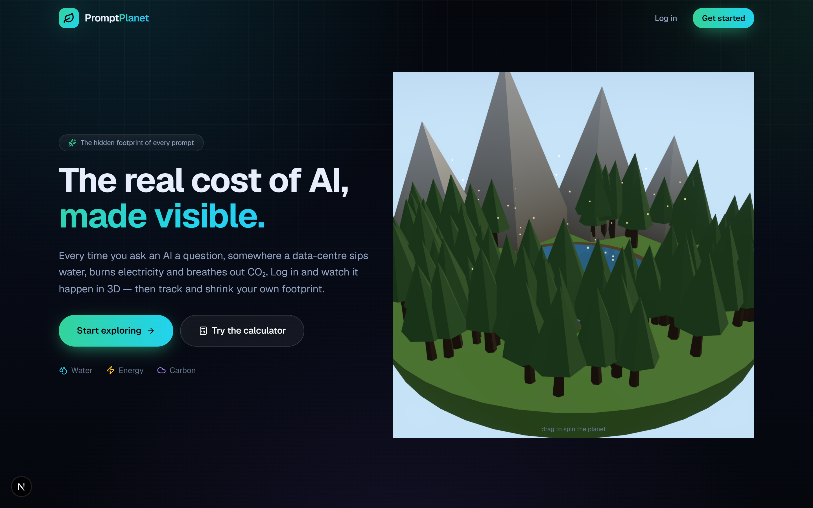
</div>

<br/>

Scroll on and the story unfolds: **one prompt's cost**, then *"multiply it by the whole planet"*, then a bar chart that puts AI in perspective against the everyday.

<table>
<tr>
<td width="50%" valign="top">
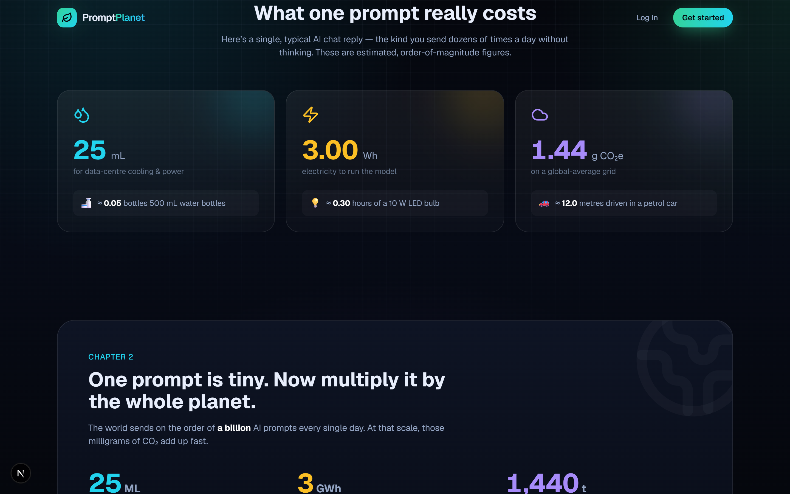
<div align="center"><sub>💧⚡☁️ &nbsp;The three costs of a single prompt</sub></div>
</td>
<td width="50%" valign="top">
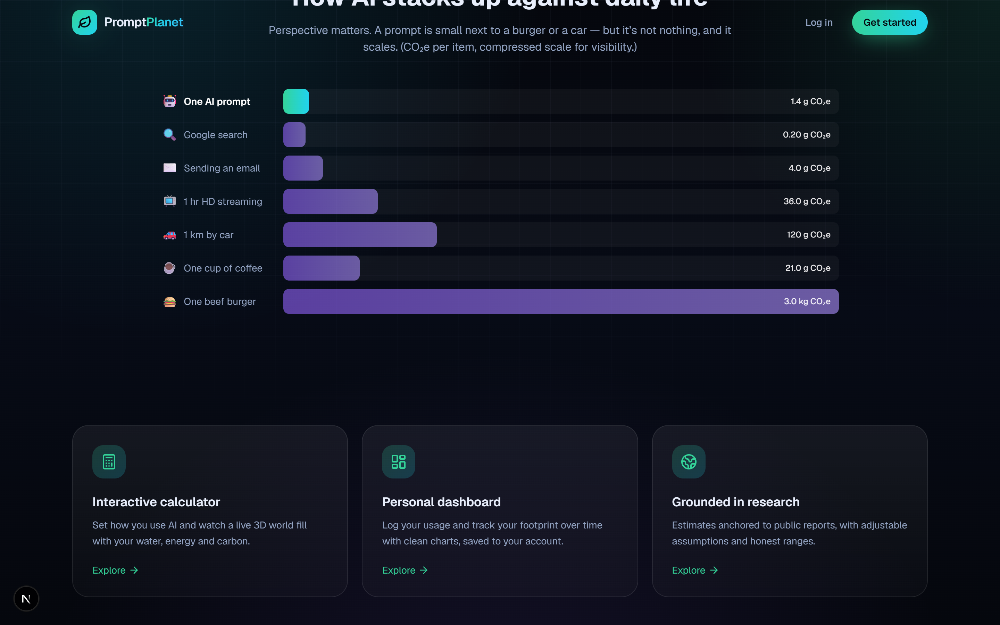
<div align="center"><sub>📊 &nbsp;How AI stacks up against daily life</sub></div>
</td>
</tr>
</table>

### 🧮 The calculator — tune your habit, watch your world

Drag the sliders for each kind of prompt — **quick questions, chat replies, long reasoning, image generation** — pick your **electricity grid**, and flip between **per day / month / year**. Cyan is water, amber is energy, violet is carbon: the heavier your day, the more your little world feels it.

<div align="center">
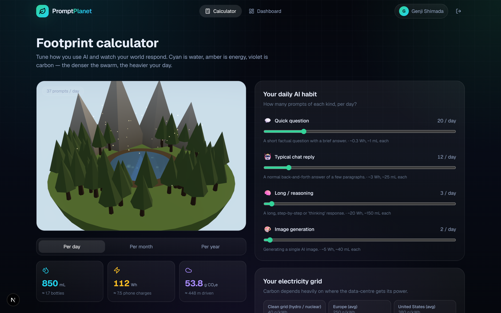
<br/><br/>
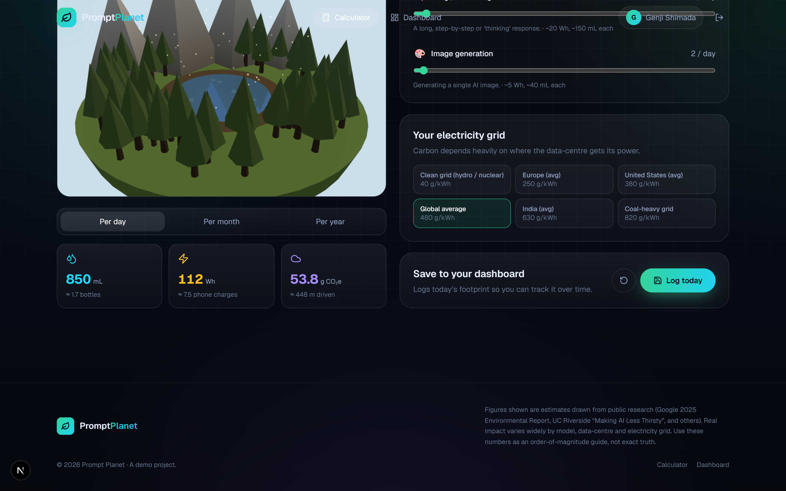
</div>

### 📈 The dashboard — your footprint over time

Log a day and it lands on your **personal dashboard**: total carbon, water, energy and prompts, an interactive **area chart** (toggle between metrics), a *"in perspective"* card, and a feed of recent logs.

<div align="center">
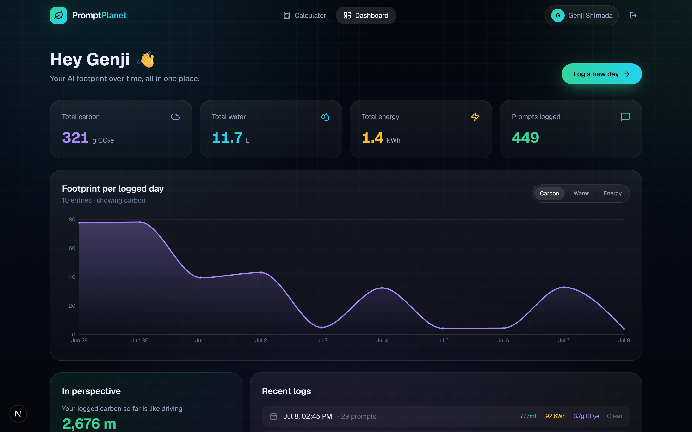
<br/><br/>
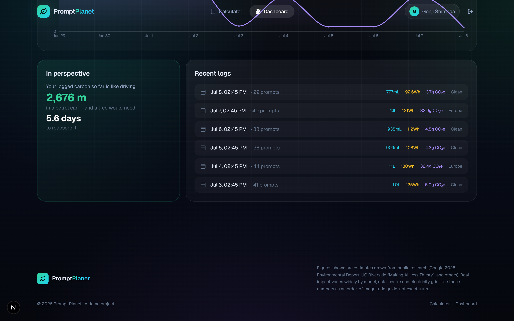
</div>

### 🔐 Sign up in seconds

Accounts are free and **stay on your own server** — a local JSON store, hashed passwords, and a signed session cookie. No third-party anything.

<table>
<tr>
<td width="50%" valign="top">
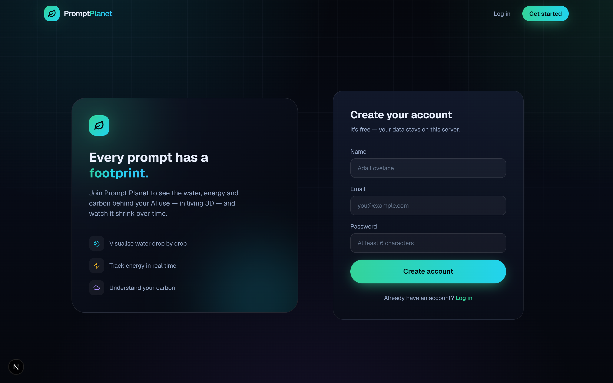
<div align="center"><sub>Create your account</sub></div>
</td>
<td width="50%" valign="top">
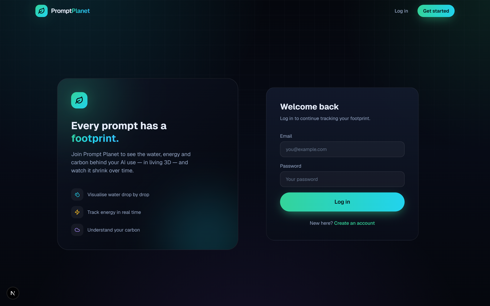
<div align="center"><sub>Welcome back</sub></div>
</td>
</tr>
</table>


## 🐉 The living 3D world

The centrepiece is a **floating snow-globe valley** whose *health* is driven entirely by your numbers. On the calculator it reacts live to your sliders; both scenes are Three.js with a soft **bloom** glow.

```
health = 1 − average( waterLoad, energyLoad, carbonLoad )     // 0 = dying · 1 = lush
```

| Metric | Drives… | Healthy | Heavy |
| :-- | :-- | :-- | :-- |
| 💧 **Water** | the lake & rivers | brimming, clear blue | shrinking, muddy |
| ⚡ **Energy** | the sky & smog | bright, clean air | hazy, overcast |
| ☁️ **Carbon** | the forest | dense green pines | thinning, browning |

It's all **procedurally generated** — a seeded `mulberry32` noise field lays out the terrain, and a pair of hand-tuned palettes (`HEALTHY` ⇄ `DEGRADED`) are interpolated by the live health value. The maths lives in pure, SSR-safe modules ([`biome.ts`](src/lib/biome.ts), [`noise.ts`](src/lib/noise.ts)); [`Biome.tsx`](src/components/three/Biome.tsx) turns those plain numbers into materials. Drag to orbit; everything reacts in real time.


## 🔬 How the footprint is estimated

Prompt Planet is **honest about uncertainty**. Public research on AI's footprint disagrees by more than **100×**, so instead of pretending there's one exact number, the app exposes a small, transparent model you can steer. All of it lives in [`src/lib/impact.ts`](src/lib/impact.ts).

**Per-prompt baselines** (energy in Wh, water in mL):

| Prompt type | Energy | Water | What it is |
| :-- | --: | --: | :-- |
| 💬 Quick question | 0.3 Wh | 1 mL | A short factual Q with a brief answer |
| 🤖 Typical chat reply | 3 Wh | 25 mL | A normal few-paragraph back-and-forth |
| 🧠 Long / reasoning | 20 Wh | 150 mL | A long, step-by-step "thinking" response |
| 🎨 Image generation | 5 Wh | 40 mL | Generating a single AI image |

**Carbon** then depends entirely on *where* the data-centre draws its power:

```
CO₂ (g) = energy (kWh) × gridIntensity (g CO₂e / kWh)
```

| Grid | Intensity |
| :-- | --: |
| 🌿 Clean (hydro / nuclear) | 40 g/kWh |
| 🇪🇺 Europe (avg) | 250 g/kWh |
| 🇺🇸 United States (avg) | 380 g/kWh |
| 🌍 Global average | 480 g/kWh |
| 🇮🇳 India (avg) | 630 g/kWh |
| 🏭 Coal-heavy | 820 g/kWh |

**Equivalences** turn abstract numbers into things you can feel — 500 mL water bottles, smartphone charges, metres driven in a petrol car, and *tree-days* needed to reabsorb the carbon.

> [!NOTE]
> **Treat every figure as an order-of-magnitude guide, not gospel.** Baselines are anchored to publicly reported sources — Google's 2025 Environmental Report (≈0.24 Wh / 0.26 mL per median Gemini text prompt), UC Riverside's *"Making AI Less Thirsty"*, and widely-cited ChatGPT energy estimates — then defaulted to a middle-of-the-range scenario. Real impact varies enormously by model, data-centre, cooling design and grid.


## 🎨 The Genji palette

A cyber-ninja dragon-green scheme — neon mint and coolant cyan over deep carbon ink, with amber and violet as the "warning" accents.

<div align="center">
</div>

| Token | Hex | Role |
| :-- | :-- | :-- |
| `brand` / Dragon Mint | `#34D399` → `#7DFFCE` | primary, glows, the leaf logo |
| `water` / Coolant Cyan | `#22D3EE` | the water metric |
| `energy` / Reactor Amber | `#FBBF24` | the energy metric |
| `carbon` / Smog Violet | `#A78BFA` | the carbon metric |
| `ink` / Carbon Ink | `#05070D` | the deep-space background |

All tokens live in [`src/app/globals.css`](src/app/globals.css) under Tailwind v4's `@theme`.


## 🛠️ Tech stack

<div align="center">

| Layer | Tools |
| :-- | :-- |
| **Framework** | Next.js 16 (App Router) · React 19 · TypeScript 5 |
| **3D / WebGL** | Three.js · @react-three/fiber · drei · postprocessing (bloom) |
| **Motion** | GSAP · Framer Motion · custom SMIL-animated SVG art |
| **Charts** | Recharts |
| **Styling** | Tailwind CSS v4 · glassmorphism · `lucide-react` icons |
| **Auth** | `jose` JWT in an httpOnly cookie · `bcryptjs` password hashing |
| **Storage** | Zero-dependency local JSON database (`data/db.json`) |

</div>


## 🚀 Quick start

> **Prerequisites:** Node.js 18.18+ (20+ recommended) and npm.

```bash
# 1 · install dependencies
npm install

# 2 · start the dev server
npm run dev

# 3 · open the planet
#     → http://localhost:3000
```

Create an account, head to the **calculator**, tune your habit, and hit **Log today** to start building your dashboard. That's it — no API keys, no Docker, no external services.

<details>
<summary><b>⚙️ Optional configuration & other scripts</b></summary>

<br/>

**Environment variables** (all optional — sensible dev defaults are built in):

| Variable | Default | Purpose |
| :-- | :-- | :-- |
| `SESSION_SECRET` | a dev fallback string | HMAC secret for signing session JWTs — **set a strong value in production** |

```bash
npm run build   # production build
npm run start   # serve the production build
npm run lint    # eslint
```

User accounts and usage logs are written to **`data/db.json`** (created automatically, git-ignored). Delete that file to reset the app to a clean slate. For real production, swap the small [`db.ts`](src/lib/db.ts) interface for Postgres/SQLite.

</details>


## 🗂️ Project structure

```
prompt-planet/
├─ src/
│  ├─ app/
│  │  ├─ page.tsx              # landing — spinnable 3D hero + the story
│  │  ├─ calculator/           # 🧮 live footprint calculator
│  │  ├─ dashboard/            # 📈 personal footprint over time
│  │  ├─ login/  signup/       # 🔐 auth screens
│  │  ├─ api/                  # auth + usage route handlers
│  │  └─ globals.css           # 🎨 Genji design tokens & utilities
│  ├─ components/
│  │  ├─ three/                # 🐉 Scene3D · HeroScene · FootprintScene · Biome
│  │  ├─ dashboard/            # UsageChart (Recharts)
│  │  ├─ auth/  layout/  ui/   # AuthForm, NavBar, Button, AnimatedNumber…
│  │  └─ providers/            # AuthProvider (client session context)
│  └─ lib/
│     ├─ impact.ts             # 🔬 the footprint model + equivalences
│     ├─ biome.ts · noise.ts   # procedural world maths (SSR-safe)
│     ├─ db.ts · session.ts    # local JSON store + JWT sessions
│     └─ utils.ts
├─ docs/
│  ├─ assets/                  # ✨ animated SVG banner, divider, mascot, palette
│  └─ screenshots/             # 📸 the images in this README
└─ data/db.json                # ← auto-created local database (git-ignored)
```

**Want to change the numbers?** Everything lives in [`src/lib/impact.ts`](src/lib/impact.ts) — per-prompt water/energy, grid-carbon presets, and the real-world equivalences.


## 🗺️ Roadmap ideas

- [ ] Shareable footprint cards (export the 3D world as an image)
- [ ] Streaks & gentle goals — reward a shrinking footprint
- [ ] Live grid-intensity data by region
- [ ] Model presets (pick your assistant, get tuned baselines)
- [ ] Pluggable database adapter (Postgres / SQLite)


<div align="center">


### Make every prompt count. 🌱

<sub>Built with Next.js, Three.js and a lot of love for the planet.<br/>
Figures are estimates for education — an order-of-magnitude guide, not exact truth.</sub>

<br/><br/>


</div>
